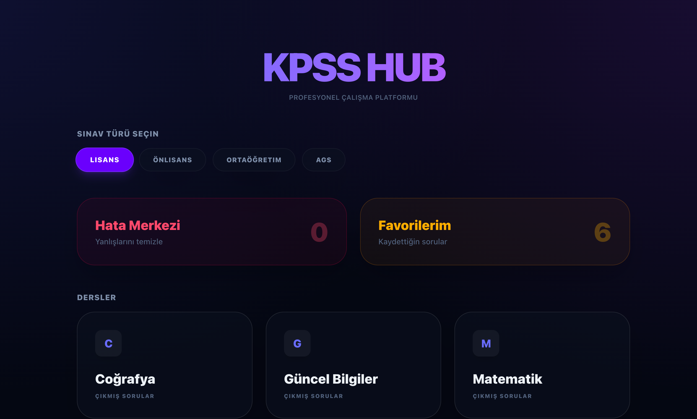
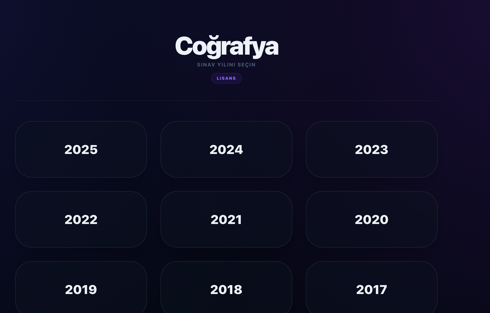
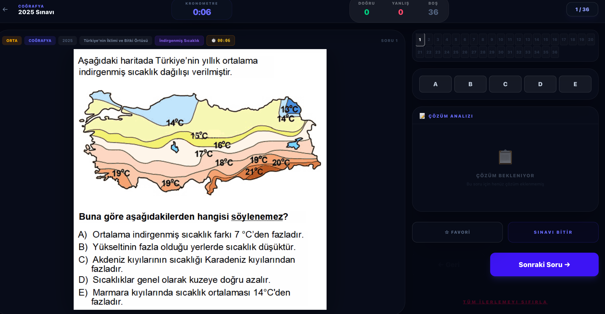

# KPSS & ALES Hub - Sınav Çözüm ve Analiz Uygulaması

Bu proje, KPSS, ALES ve benzeri sınavların çıkmış sorularını organize etmek, çözmek ve analiz etmek için geliştirilmiş kapsamlı bir sınav platformudur. İçerisinde frontend (React/Vite), backend (Node.js/Express) ve Python tabanlı soru ayıklama araçlarını barındırmaktadır.

## Ekran Görüntüleri

Projemizden bazı görünümler:

### 1. Ana Sayfa & Seçim Ekranı

### 2. Soru Çözüm Ekranı

### 3. Analiz ve Hata Merkezi

## Özellikler
- **Soru Havuzu**: Sınavları, derslere ve yıllara göre kategorize ederek çözme imkanı.
- **Hata Merkezi**: Yanlış yapılan soruların kaydedilip sonradan tekrar çözülebilmesi.
- **Favoriler**: Önemli soruların favorilere eklenmesi.
- **Kronometre & İstatistikler**: Sınav sırasında süre tutma ve detaylı başarı oranları.
- **Python Araçları**: PDF tabanlı çıkmış soruları otomatik olarak soru soru kırpıp sisteme entegre edebilme.
